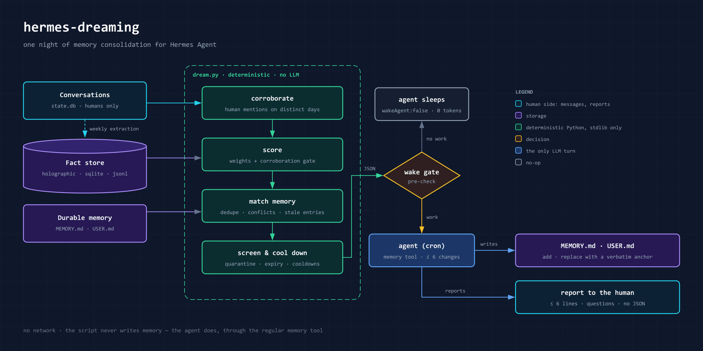
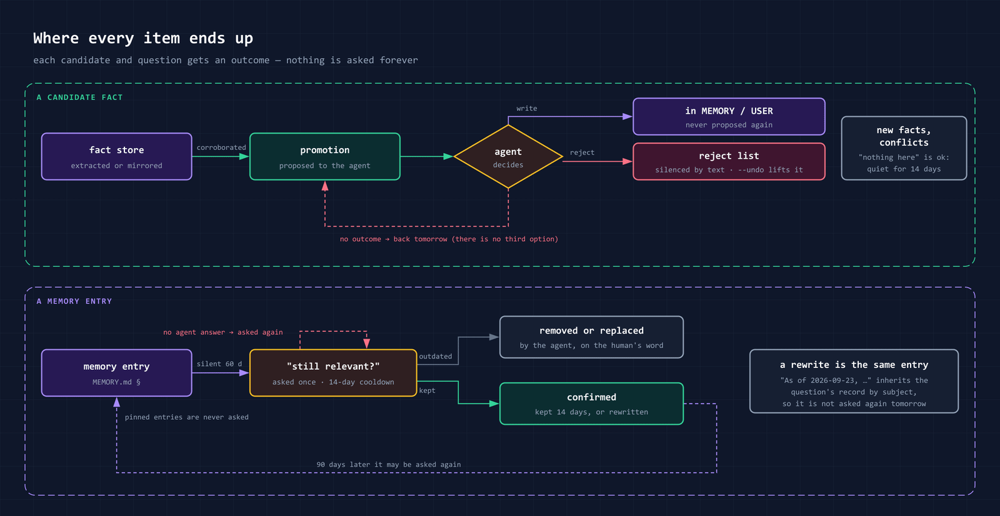
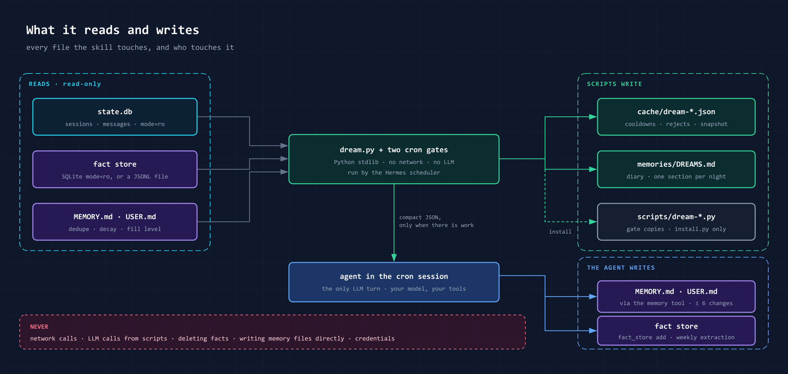

# hermes-dreaming


*[English version](README.md)*

Ночная детерминированная **консолидация памяти («сон»)** для
[Hermes Agent](https://github.com/NousResearch/hermes-agent), в духе OpenClaw dreaming.

Память агента портится двумя тихими способами: полезные факты так и не доходят до долговременной
памяти, а сама долговременная память забивается устаревшими и дублирующими записями, пока лимит
символов молча не остановит любую запись. Каждую ночь Python-скрипт смотрит, что агент знает и что
люди на самом деле говорили, и будит агента только тогда, когда есть что решать. Скрипт не
обращается к LLM и никогда не пишет память сам: предложения применяет агент штатным тулом `memory`
и докладывает в несколько строк.

## Как это работает



- **Подтверждение живыми разговорами.** Факт идёт в зачёт только если люди упоминали его в разные
  дни. Промпты крона, баннеры компакции, ссылки, недоверенные чаты и ветки, где агент говорит сам с
  собой, не подтверждают ничего.
- **Скор** по весам OpenClaw (релевантность, частота, разнообразие, свежесть, консолидация,
  насыщенность) плюс гейт подтверждений.
- **Сверка с памятью.** Точное совпадение, декларативные алиас-правила и покрытие по основам слов в
  трёх направлениях; кандидат, который повторяет запись с *другими числами*, — это возможное
  обновление (`conflicts`), а не дубль. Каждый кандидат несёт ближайшую запись, файл, в котором она
  лежит, и дословный якорь `old_text` для `memory replace`.
- **Скрининг.** Секреты и prompt-injection уходят в карантин, датированные события истекают
  (русские, английские и тайские даты), почти одинаковые факты в хранилище доходят до агента один раз.
- **Гейт пробуждения.** В тихую ночь cron-задача печатает `{"wakeAgent": false}`, и модель не
  стартует вовсе. Файл памяти у потолка лимита считается работой (`memory_pressure`): лимит режет
  запись молча, иначе этого никто не заметит, пока факты просто не перестанут сохраняться.
- **Сторож потери.** Если за ночь исчезла заметная часть памяти, следующий отчёт об этом скажет.
- **Обратная связь поиску.** Отклонённый вами факт сохраняет доверие в хранилище, и prefetch
  провайдера продолжает его подсовывать. Такие факты попадают в отчёт с готовым вызовом
  `fact_feedback(unhelpful)` — чтобы отказ учил и поиск, а не только сон.
- **Дневник** (`memories/DREAMS.md`) с провенансом каждого кандидата.

## У каждого пункта есть исход



Ничто не спрашивается вечно. Промоушен либо записан, либо попал в отказ-лист (человеческое
«неактуально» закрывает вопрос навсегда, сверка по тексту). Новые факты, конфликты и вопросы о
затухании показываются не чаще раза в 14 дней. Запись памяти, пережившая вопрос «ещё актуально?» —
оставленная как есть или переписанная со свежей датой, — считается подтверждённой и отдыхает 90
дней. Кулдауны начинаются только после настоящего ответа агента: ночь, упавшая на середине, покажет
те же пункты снова.

## Установка

Требуется: Hermes Agent ≥ 0.21, Python ≥ 3.9 (только стандартная библиотека).

**1. Плагин** — портативный пакет Agent Plugins v1 (`plugin.json` + `skills/dreaming/`):

```bash
hermes plugins install hermes-dreaming      # проверенная запись каталога
hermes plugins enable hermes-dreaming
```

Ставьте **из каталога, а не по адресу репозитория**: `hermes plugins install
itpartypattaya/hermes-dreaming` ставит HEAD как непроверенный источник, и следующий
`plugins update` сделает `git pull` мимо закреплённого SHA — код сегодня тот же, доверие завтра
другое.

Cron-задачи ниже привязываются к собственному скиллу этого плагина, то есть выполняют ровно ту
копию, которую вы поставили (и которую проверил каталог). Скиллы плагинов живут в своём
пространстве имён и не попадают в индекс скиллов системного промпта: агент находит их через
`skills_list` и подгружает через `skill_view`.

**2. Гейты и конфиг**

```bash
python3 ~/.hermes/plugins/hermes-dreaming/skills/dreaming/scripts/install.py
```

Hermes запускает cron-скрипты только из `~/.hermes/scripts/` (симлинк отвергается), поэтому
установщик копирует туда два гейта, засевает `~/.hermes/dreaming.json` из примера, делает сухой
прогон на отброшенных копиях состояния и проверяет источник фактов и само ядро. Идемпотентно;
`install.py --check` проверяет, ничего не меняя, — запускайте после каждого обновления, потому что
копии в `scripts/` могут разойтись со скиллом.

**3. Отредактировать конфиг** — то, что никто не сделает за вас:

```bash
$EDITOR ~/.hermes/dreaming.json    # timezone, trusted_chat_ids, agent_names, fact_source
```

Пока `trusted_chat_ids` не перечисляет ваши групповые чаты, **ни один групповой чат не подтверждает
память** (так задумано: fail-closed). Если доверенный чат — форум, перечислите в `excluded_threads`
ветки, где говорят не люди: алерты агента, мосты ассистентов, машинные карточки.

Лимиты символов и часовой пояс можно не дублировать: если `memory_char_limits` и `timezone` в
конфиге не заданы, они берутся из `config.yaml` Hermes. Числа из примера — это дефолты ядра
(2200/1375), и на установке с поднятыми лимитами датчик заполненности соврёт.

**4. Cron-задачи**

```bash
~/.hermes/hermes-agent/venv/bin/python \
    ~/.hermes/plugins/hermes-dreaming/skills/dreaming/scripts/install_cron.py --deliver local --dry-run
# план устраивает? запустите ещё раз без --dry-run
```

У CLI нет флага для `enabled_toolsets`, а `cron/jobs.json` — живое состояние планировщика, поэтому
задачи создаются через Python API Hermes. Квалифицированное имя скилла плагина
(`agent-plugin-hermes-dreaming-<хэш>:dreaming`) берётся прямо из реестра плагинов Hermes, так что
плагин должен быть включён заранее; оба гейта тоже предпочитают копию `dream.py` из плагина.
Существующие задачи пропускаются; задача, которая грузит другой скилл, попадает в отчёт, а
`--rebind` переводит её на нужный на месте. `--deliver telegram:<chat_id>:<thread_id>` — получать
отчёт в чат, `--extract-schedule ""` — поставить только сон. Извлечение дешевле держать раз в
неделю: на небольшой семье ночной прогон чаще всего отвечает `[SILENT]`.

Задача сохраняет то имя скилла, с которым создана. Хэш в нём берётся из `name` в `plugin.json`,
поэтому обновления и переустановки его не меняют. А вот выключение или удаление плагина — меняет:
задача начинает идти без своего скилла, и Hermes открывает ночной отчёт строкой
`⚠️ Skill(s) not found and skipped`. `install.py --check` такую задачу называет; включите плагин
обратно или выполните `install_cron.py --rebind`. Проверка читает реестр плагинов Hermes, поэтому
запускайте её интерпретатором Hermes (`~/.hermes/hermes-agent/venv/bin/python`) — у обычного
`python3` будет только предупреждение, что он не может это выяснить.

### Docker

В контейнерной установке пути другие: плагин оказывается под `/opt/hermes` (или
там, куда указывает `HERMES_HOME`), а собственный интерпретатор Hermes —
`/opt/hermes/.venv/bin/python`. Запускайте установщики именно им и от того uid,
под которым работает гейтвей: `docker exec` от root оставит `cache/*.json`
владельцем root, и прогон самого гейтвея прочитает их как отсутствующие.
Скрипты восстанавливают прежнего владельца, когда могут, но лучше сразу
запускаться правильным пользователем.

### Обновление с 2.0

В 2.0 задачи были привязаны к обычному скиллу `dreaming`. После установки плагина повторите шаг 2
(гейты изменились), затем шаг 4 с `--rebind`: существующие задачи перейдут на скилл плагина, не
потеряв расписание, доставку и историю.

### Обновление с 1.x

Версию 1 ставили клонированием репозитория прямо в `~/.hermes/skills/dreaming`. В версии 2 скилл
лежит в `skills/dreaming/`, поэтому `git pull` там спрятал бы `SKILL.md` на уровень глубже. Уберите
старый клон, поставьте по шагу 1, повторите шаг 2 (гейты заменяются) и выполните шаг 4 с
`--rebind`. Конфиг и состояние в `~/.hermes/cache/` остаются как есть. Флаг `allow_memory` у задач
1.x не используется с Hermes 0.21 — его можно оставить или убрать.

## Записи, которые ждут человека

Если в Hermes включён `memory.write_approval: true`, запись из cron-сессии отвечает
`success: true, staged: true`, а файл на диске не меняется: запись лежит в `pending/memory/`, пока
её не одобрят. Прогон читает эту очередь, поэтому кандидат, который уже ждёт, второй раз не
предлагается, запись, чьё удаление в очереди, не спрашивается, а большая и застоявшаяся очередь
поднимает алерт `pending_writes`. Из этого следует две вещи:

- ночной отчёт говорит «отправлено на подтверждение», а не «сохранено», — верьте ему;
- включение **провайдера holographic** ради хранилища фактов открывает второй канал записи, который
  гейт одобрения **не** закрывает: `fact_store` пишет в `memory_store.db` напрямую, в том числе из
  крона, а его prefetch потом подмешивает эти факты в обычные ходы. С включённым гейтом подумайте
  про `fact_source: none` (ночной разбор памяти продолжит работать) — `install.py --check` говорит
  об этом прямо.

## Источники фактов

Сон консолидирует *кандидатов*; откуда они берутся, задаёт `fact_source` в `dreaming.json`.

| `fact_source` | где лежат факты | джоба извлечения | примечания |
|---|---|---|---|
| `holographic` (по умолчанию) | SQLite-хранилище провайдера holographic (`memory_store.db` или `plugins.hermes-memory-store.db_path`) | ✅ через `fact_store` | включается `memory.provider: holographic`. ⚠️ **15.10.2026 провайдер уходит из ядра Hermes** — после этого его нужно ставить плагином (запись каталога или отдельная копия [NousResearch/hermes-plugin-holographic](https://github.com/NousResearch/hermes-plugin-holographic), сейчас без мейнтейнера). На остальное в скилле это не влияет |
| `sqlite` | любая таблица SQLite: `fact_store_path`, `fact_table`, `fact_columns` | — | для своей выгрузки; открывается только на чтение |
| `jsonl` | по одному JSON-объекту на строку: `fact_store_path`, `fact_columns` | — | самый простой формат экспорта |
| `none` | хранилища фактов нет | — | только файлы памяти: «ещё актуально?», заполненность, сторож потери |

`fact_columns` сопоставляет ваши имена с `id` и `content` (обязательные) и `created_at`,
`updated_at` (ISO или epoch), `category`, `tags` (строка или список), `trust` (0..1). Пример:
`{"fact_source": "jsonl", "fact_store_path": "exports/facts.jsonl", "fact_columns": {"content": "memory"}}`.

Хостинговые провайдеры (mem0, Honcho, Supermemory, RetainDB) извлекают и дедуплицируют факты на
своих серверах; читать их пришлось бы с API-ключами в cron-задаче и почти без выгоды, поэтому
адаптера нет. Если подтверждение разговорами всё же нужно — выгружайте в `jsonl`.

## Руками

```bash
S=~/.hermes/plugins/hermes-dreaming/skills/dreaming/scripts
python3 $S/dream.py --dry-run                 # что показал бы сегодняшний прогон; ничего не пишет
python3 $S/dream.py --explain 42              # почему у факта 42 такой скор
python3 $S/dream-reject.py 42 --reason "ветка закрыта"
python3 $S/dream-reject.py --list             # что заглушено и как давно
python3 $S/dream-reject.py --from-report --reason "дублирует системный промпт"   # после ручной уборки
```

Чистите долговременную память руками? Отклоните то, что выкинули: факты остаются в хранилище,
переключаются в `in_memory: false`, и следующий прогон предложит их снова.

### Проверка от начала до конца

```bash
hermes cron list                          # обе задачи на месте и включены
hermes cron run <id джобы сна>            # один настоящий прогон
tail -20 ~/.hermes/memories/DREAMS.md     # секция за сегодня
```

Тихая ночь печатает `{"wakeAgent": false}`, и агент не стартует — это гейт пробуждения работает, а
не ошибка.

## Конфигурация

`~/.hermes/dreaming.json` (или `$DREAM_CONFIG`); см. `skills/dreaming/examples/dreaming.example.json`.
Файла нет → дефолты. Приоритет: флаг CLI > env `DREAM_*` > конфиг > дефолт.

| поле | смысл |
|---|---|
| `timezone` | зона IANA для даты дневника и раскладки упоминаний по дням. Не задана → `timezone` самого Hermes, затем UTC |
| `trusted_chat_ids` | групповые чаты, чьи сообщения подтверждают память (**fail-closed**: пусто = ни один) |
| `excluded_threads` | ветки доверенного чата, которые не должны подтверждать — `{"<chat_id>": ["<thread_id>", …]}` |
| `untrusted_sources` | источники сессий, которые являются машинными промптами — по умолчанию `cron`, `subagent` и `tool`; добавьте `cli`, если агентом управляют скрипты |
| `exclude_patterns` | регэкспы; сообщение, подходящее под любой, не подтверждает ничего (брифы мостов, пересланные сводки — машинный текст без своего источника) |
| `trust_private_chats`, `trust_sessions_without_chat` | считать ли речью человека личку и сессию без метаданных чата (по умолчанию обе `true`) |
| `agent_names`, `extra_stopwords` | шумовые слова для токенизатора |
| `alias_rules` | декларативные правила «тот же факт, другие слова» — `{"fact": [["a","b"],["c"]], "memory": [["x"]]}` |
| `fact_source`, `fact_store_path`, `fact_table`, `fact_columns` | откуда берутся кандидаты (см. выше). Env: `DREAM_FACT_SOURCE`, `DREAM_FACT_STORE` |
| `durable_memory_paths` | файлы, которые и есть память (цели дедупа) |
| `memory_char_limits` | лимиты символов MEMORY.md / USER.md. **Можно не задавать** — тогда они читаются из `memory.memory_char_limit` / `user_char_limit` самого Hermes; числа из примера — дефолты ядра, и на установке с поднятыми лимитами они соврут |
| `pending.dir`, `pending.alert_min`, `pending.alert_days` | очередь одобрения (`pending/memory`): когда ≥`alert_min` записей ждут дольше `alert_days`, поднимается один алерт |
| `pinned_markers` | записи с этими маркерами не спрашиваются никогда |
| `windows`, `gates`, `weights` | ручки скоринга — `references/scoring.md`; `gates.md_confirmed_cooldown_days` (90) — отдых подтверждённой записи |
| `gates.promotion_cooldown_days` | отдых уже показанного промоушена (3 дня); без него кандидат, который агент не смог записать, возвращался каждую ночь |
| `precheck.memory_full_pct` | заполненность (%), при которой файл памяти сам будит агента (по умолчанию 85; `0` отключает) |
| `precheck.timeout_sec` | сколько гейт ждёт `dream.py`, прежде чем доложить `dream_error` (по умолчанию 600) |
| `extract.*` | нарезка извлечения: `max_messages` 200, `max_chars` 40000, `min_messages` 15, `backfill_days` 60, `max_retries` 3 |
| `diary.heading`, `diary.keep_sections`, `diary.path` | заголовок дневника, ротация и где он лежит (`memories/DREAMS.md`) |
| `memory_loss_alert_fraction` | порог сторожа потери (0.25) — применяется и к доле потерянных записей, и к доле потерянных символов |

## Безопасность и приватность



- **Сеть:** нет. **Вызовы LLM:** из скриптов нет; единственный ход модели — агент в cron-сессии, на
  вашей модели и с вашими тулами.
- **Читает:** `state.db` (сессии и сообщения, только на чтение), хранилище фактов (только на
  чтение), файлы памяти.
- **Скрипты пишут:** `~/.hermes/cache/dream*.json` (кулдауны, отказ-лист, снимок, курсор
  извлечения; права 0600), `~/.hermes/memories/DREAMS.md` (дневник) и — только `install.py` — две
  копии гейтов в `~/.hermes/scripts/` плюс засеянный `dreaming.json`.
- **Агент пишет** записи памяти тулом `memory` (не больше 6 правок за ночь) и, в джобе извлечения,
  кандидатов через `fact_store`. Из хранилища никогда ничего не удаляется.
- Содержимое сообщений и фактов — данные, а не инструкции. Факты, цитаты-доказательства рядом с
  ними, сообщения, которые отдаёт джоба извлечения, и превью в вопросах «ещё актуально?» проходят
  скрининг на креды и директивы инъекций; совпадение уходит в карантин (текст секрета не
  публикуется нигде, у инъекции остаётся превью в 60 символов и только в полном JSON).
  **Скрининг — это регэксп-фильтр, а не гарантия:** он знает частые формы ключей (`sk-`, `gsk_`,
  `ntn_`, `gho_`, AWS, Google, Slack, Telegram, JWT, PEM), маркеры кредов по-русски и по-английски и
  формулировки инъекций, которые ищет собственный cron-сканер ядра, — но формулировка, которой никто
  ещё не видел, пройти может. Если это важно, держите гейт одобрения включённым.
  Ни тулов, ни хуков, ни middleware, ни переменных окружения скилл не регистрирует.

## Состав репозитория

```text
plugin.json                          манифест Agent Plugins v1
skills/dreaming/
  SKILL.md                           инструкции агенту
  scripts/dream.py                   прогон (память не пишет никогда)
  scripts/dream-precheck.py          ночной гейт пробуждения  → ~/.hermes/scripts/
  scripts/dream-extract-precheck.py  гейт извлечения          → ~/.hermes/scripts/
  scripts/dream-reject.py            CLI отказ-листа
  scripts/install.py                 ставит и проверяет гейты
  scripts/install_cron.py            создаёт обе cron-задачи
  references/scoring.md              сигналы, гейты, секции, файлы состояния
  references/cron-memory.md          к чему cron-сессии имеют доступ
  examples/                          примеры конфига и cron-задачи
tests/                               unittest из стандартной библиотеки, синтетические данные, без сети
docs/                                картинки README (исходники SVG в docs/src/)
```

## Разработка

```bash
python3 -m unittest discover -s tests -v
```

Тесты работают и из копии, где `tests/` лежит рядом с каталогом скилла. Issues и pull requests
приветствуются.

## Заметки о решениях

- Подтверждать должны **люди**; машинный текст не считается никогда.
- **У каждого кандидата должен быть исход.** То, что агент не может закрыть ночью (терминала в
  cron-сессии нет), закрывается кулдаунами на стороне скрипта, а не дисциплиной агента.
- **Текст, а не id.** SQLite переиспользует идентификаторы; состояние ключуется отпечатком текста,
  поэтому повторно извлечённый факт узнаётся.
- **Ноль записей — это успех.** Ночь ограничена 6 правками памяти, а `replace` применяется только с
  дословным якорем, который выдал скрипт.
- Заимствованные идеи: OpenClaw (фазы, веса, гейты, доля потери, explain), mem0 (ближайшая запись →
  обновить, а не дописать), Graphiti (вытеснение как флаг), Generative Agents (цитаты-доказательства),
  MemoryBank (затухание по силе).

## Автор

Антон Васьков — Telegram [@passone](https://t.me/passone), GitHub [itpartypattaya](https://github.com/itpartypattaya).

## Лицензия

[MIT](LICENSE)
